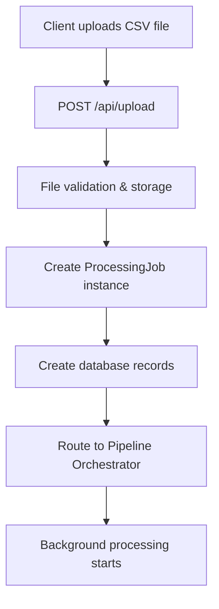
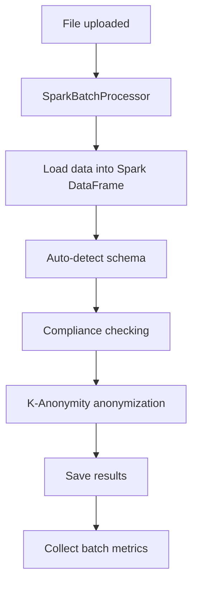
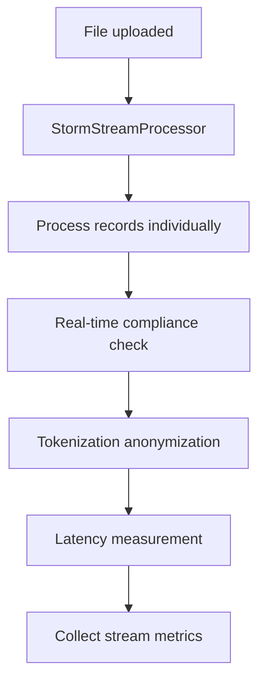
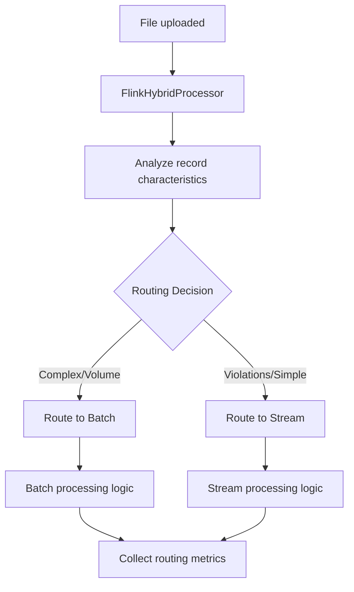

# Pipeline Processing Workflow Documentation

## Overview

This document explains how file upload to processing works for each pipeline type (`batch`, `stream`, `hybrid`) in the new pipeline orchestrator system.

## 🔄 Complete Upload to Processing Flow

### Phase 1: File Upload & Job Creation



**Key Steps:**

1. **File Reception**: `POST /api/upload` endpoint receives file
2. **Validation**: CSV format, 16MB limit, file hash calculation
3. **Job Setup**: Creates `ProcessingJob` with `pipeline_type` parameter
4. **Database Records**: Creates `data_files` and `data_processing_jobs` entries
5. **Pipeline Routing**: Routes to appropriate processor based on `pipeline_type`

### Phase 2: Pipeline-Specific Processing

## 📊 BATCH Pipeline (`pipeline_type: 'batch'`)

### Architecture: Spark-Based Batch Processing



### Processing Details:

**1. Data Loading**

```python
# Uses Spark session with optimizations
df = processor.load_data(filepath)
# - Auto-detects schema from sample data
# - Applies proper Spark data types
# - Handles large files efficiently
```

**2. Compliance Checking**

```python
df_with_compliance = processor.check_compliance(df)
# - Converts to Pandas for rule engine compatibility
# - Applies modular compliance rules (HIPAA/GDPR)
# - Adds compliance metadata to each record
```

**3. Anonymization Method: K-Anonymity**

```python
df_anonymized = processor.anonymize_data(df_with_compliance, method="k_anonymity")
# - Generalizes diagnoses into broader categories
# - Masks PHI identifiers (SSN, phone, email)
# - Preserves data utility for analysis
```

**4. Research Metrics Collected**

```json
{
  "pipeline_type": "batch",
  "total_records": 1000,
  "violation_records": 150,
  "violation_rate": 0.15,
  "processing_time_seconds": 2.45,
  "throughput_records_per_second": 408.2,
  "anonymization_method": "k_anonymity",
  "output_file": "data/processed/batch_processed_abc123.csv"
}
```

**5. Output Characteristics**

- High throughput processing
- Optimized for large datasets
- Comprehensive compliance analysis
- K-anonymity provides strong privacy guarantees

---

## ⚡ STREAM Pipeline (`pipeline_type: 'stream'`)

### Architecture: Real-Time Record Processing



### Processing Details:

**1. Record-by-Record Processing**

```python
for idx, record in df.iterrows():
    # Process each record individually to simulate streaming
    violations = processor.check_compliance(record_dict)
    # - Immediate violation detection
    # - Low-latency processing
```

**2. Compliance Checking**

```python
violations = processor.check_compliance_realtime(record)
# - Uses quick compliance check for speed
# - Maintains consistency with batch rules
# - Optimized for streaming latency
```

**3. Anonymization Method: Tokenization**

```python
record_dict = processor.anonymize_data(record_dict, method="tokenization")
# - Fast deterministic token replacement
# - Maintains referential integrity
# - Hash-based tokens for consistency
```

**4. Research Metrics Collected**

```json
{
  "pipeline_type": "stream",
  "total_records": 1000,
  "violation_records": 150,
  "violation_rate": 0.15,
  "processing_time_seconds": 0.85,
  "throughput_records_per_second": 1176.5,
  "average_latency_seconds": 0.00085,
  "max_latency_seconds": 0.0021,
  "min_latency_seconds": 0.00042,
  "anonymization_method": "tokenization"
}
```

**5. Output Characteristics**

- Low-latency processing
- Real-time violation detection
- Tokenization for fast anonymization
- Detailed latency metrics for research

---

## 🔀 HYBRID Pipeline (`pipeline_type: 'hybrid'`)

### Architecture: Intelligent Routing System



### Processing Details:

**1. Intelligent Characteristics Analysis**

```python
characteristics = processor.analyze_data_characteristics(record_dict)
# - Calculates complexity score
# - Detects violations
# - Estimates processing requirements
```

**2. Routing Decision Engine**

```python
decision = processor.make_routing_decision(record_dict, characteristics)
# Priority rules:
# 1. Violations → Stream (urgent handling)
# 2. High volume → Batch (efficiency)
# 3. Complex data → Batch (optimization)
# 4. Default → Stream (low latency)
```

**3. Dual Processing Paths**

```python
if decision['route'] == 'batch':
    # Simulated batch processing
    record_dict['processed_via'] = 'batch'
else:
    # Real-time stream processing
    record_dict['processed_via'] = 'stream'
```

**4. Research Metrics Collected**

```json
{
  "pipeline_type": "hybrid",
  "total_records": 1000,
  "violation_records": 150,
  "batch_routed_records": 300,
  "stream_routed_records": 700,
  "batch_routing_percentage": 30.0,
  "stream_routing_percentage": 70.0,
  "average_latency_seconds": 0.0012,
  "routing_decisions": [
    { "record_id": "P001", "route": "stream", "reason": "urgent_violation" },
    { "record_id": "P002", "route": "stream", "reason": "realtime_processing" }
  ]
}
```

**5. Output Characteristics**

- Adaptive processing based on data characteristics
- Intelligent violation routing
- Comprehensive routing analytics
- Balanced latency and throughput

---

## 🎯 Research Evaluation Framework Integration

### Metrics Collection Endpoints

**Individual Pipeline Metrics**

```http
GET /api/pipeline/metrics?pipeline_type=batch
GET /api/pipeline/metrics?pipeline_type=stream
GET /api/pipeline/metrics?pipeline_type=hybrid
```

**Comparative Analysis**

```http
GET /api/pipeline/metrics/comparison
```

**Response Example:**

```json
{
  "throughput_comparison": {
    "batch": { "average": 408.2, "max": 450.1, "min": 380.5 },
    "stream": { "average": 1176.5, "max": 1200.8, "min": 1150.2 },
    "hybrid": { "average": 892.3, "max": 920.1, "min": 870.5 }
  },
  "latency_comparison": {
    "stream": { "average_latency": 0.00085, "max_latency": 0.0021 },
    "hybrid": { "average_latency": 0.0012, "max_latency": 0.0025 }
  },
  "violation_detection_comparison": {
    "batch": { "average_violation_rate": 0.15, "total_jobs": 5 },
    "stream": { "average_violation_rate": 0.15, "total_jobs": 3 },
    "hybrid": { "average_violation_rate": 0.15, "total_jobs": 4 }
  }
}
```

### Key Research Questions Addressed

**RQ1: Batch vs Real-time Verification**

- **Batch**: High throughput, comprehensive analysis, K-anonymity
- **Stream**: Low latency, real-time detection, tokenization
- **Metrics**: Throughput, latency, violation detection accuracy

**RQ2: Anonymization Technique Comparison**

- **Batch**: K-anonymity with data generalization
- **Stream**: Tokenization with deterministic hashing
- **Hybrid**: Adaptive anonymization based on routing
- **Metrics**: Privacy preservation, data utility, processing overhead

**RQ3: Hybrid Architecture Evaluation**

- **Intelligent Routing**: Violation-based, volume-based, complexity-based
- **Adaptive Processing**: Best of both batch and stream
- **Metrics**: Routing accuracy, combined performance, resource optimization

---

## 📁 Output File Structure

Each pipeline creates distinct output files with clear identification:

**Batch Output:**

```csv
id,patient_name,ssn_masked,phone_masked,email_masked,diagnosis_generalized,compliance_violations,is_compliant,processed_at
P001,John Doe,***-**-****,***-***-****,***@***.com,chronic_disease,3,false,2024-01-15T10:30:00
```

**Stream Output:**

```csv
id,patient_name,ssn,phone,email,diagnosis,processed_via,has_violations,violation_count,processed_at
P001,PATIENT_001,TOKEN_6789,PHONE_TOKEN_123,EMAIL_TOKEN_456,diabetes,stream,true,3,2024-01-15T10:30:00
```

**Hybrid Output:**

```csv
id,patient_name,ssn,phone,email,diagnosis,processed_via,routing_reason,has_violations,processed_at
P001,PATIENT_001,TOKEN_6789,PHONE_TOKEN_123,EMAIL_TOKEN_456,diabetes,stream,urgent_violation,true,2024-01-15T10:30:00
P002,Jane Smith,***-**-****,***-***-****,***@***.com,hypertension,batch,high_complexity,false,2024-01-15T10:30:00
```

---

## 🚀 Usage Examples

### Upload File with Specific Pipeline

```bash
curl -X POST http://localhost:5001/api/upload \
  -F "file=@healthcare_data.csv" \
  -F "pipeline=batch" \
  -F "user_role=admin"
```

### Process Existing File Through Pipeline

```bash
curl -X POST http://localhost:5001/api/pipeline/process \
  -H "Content-Type: application/json" \
  -d '{
    "job_id": "abc123-def456",
    "filepath": "data/uploads/healthcare_data.csv",
    "pipeline_type": "hybrid"
  }'
```

### Get Research Metrics

```bash
curl http://localhost:5001/api/pipeline/metrics/comparison
```

---

## 🔧 System Status Check

### Verify Pipeline Processors

```http
GET /api/pipeline/processors/status
```

**Response:**

```json
{
  "processors": {
    "batch": {
      "available": true,
      "type": "SparkBatchProcessor",
      "initialized": true
    },
    "stream": {
      "available": true,
      "type": "StormStreamProcessor",
      "initialized": true
    },
    "hybrid": {
      "available": true,
      "type": "FlinkHybridProcessor",
      "initialized": true
    }
  }
}
```

This new system ensures that `pipeline_type` actually determines which processor is used, enabling proper research evaluation and metrics collection for comparative analysis.
